# Skills measured prior to January 31, 2023 
• Prepare the data (15–20%) 
• Model the data (30–35%) 
• Visualize and analyze the data (30–35%) 
• Deploy and maintain assets (10–15%) 

# Functional groups 

## Prepare the data (15–20%) 
### Get data from different data sources
• ~~Identify and connect to a data source~~  
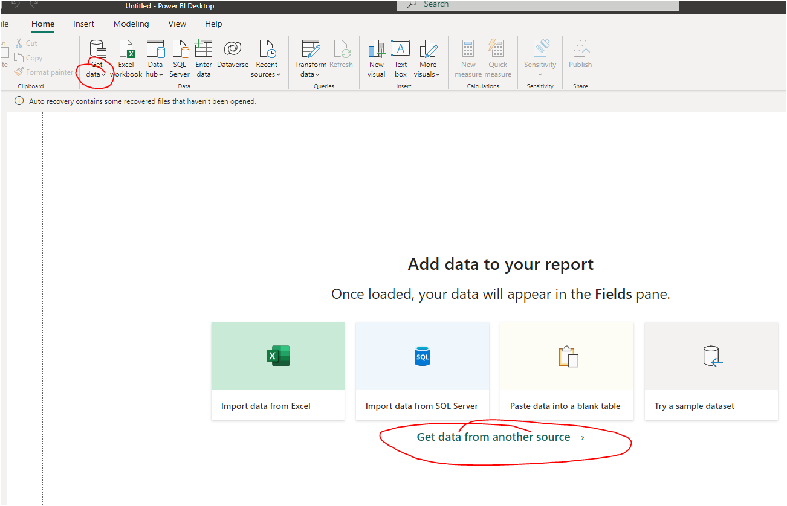
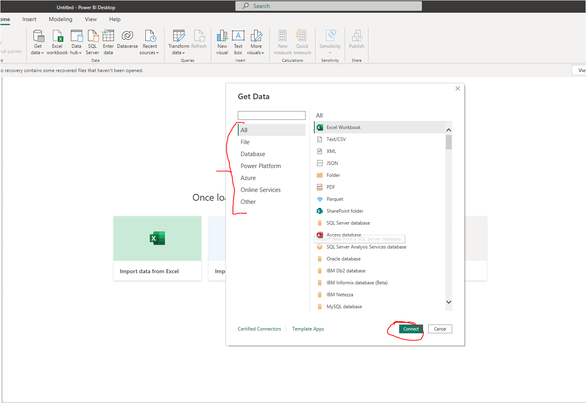
• ~~Change data source settings~~  
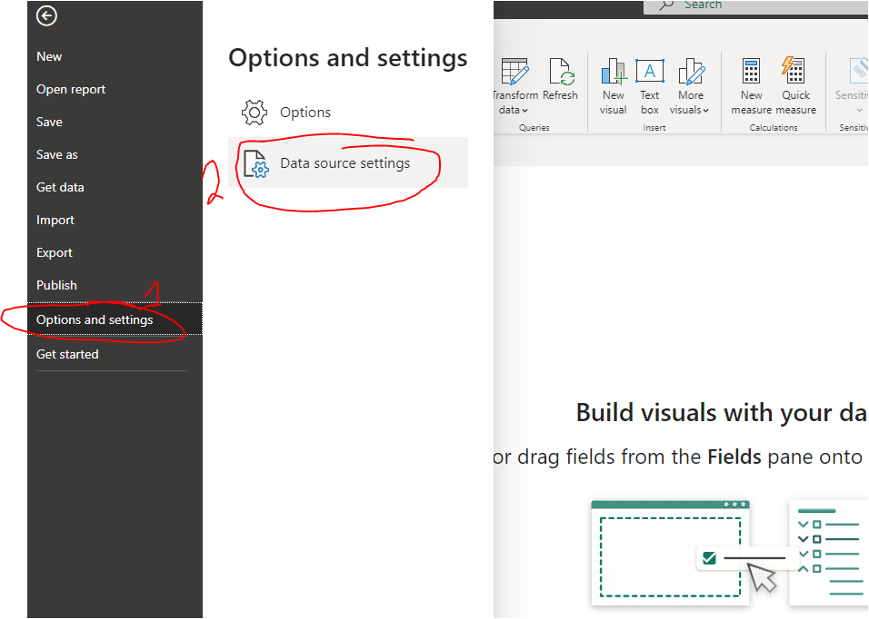
• ~~Select a shared dataset or create a local dataset~~  
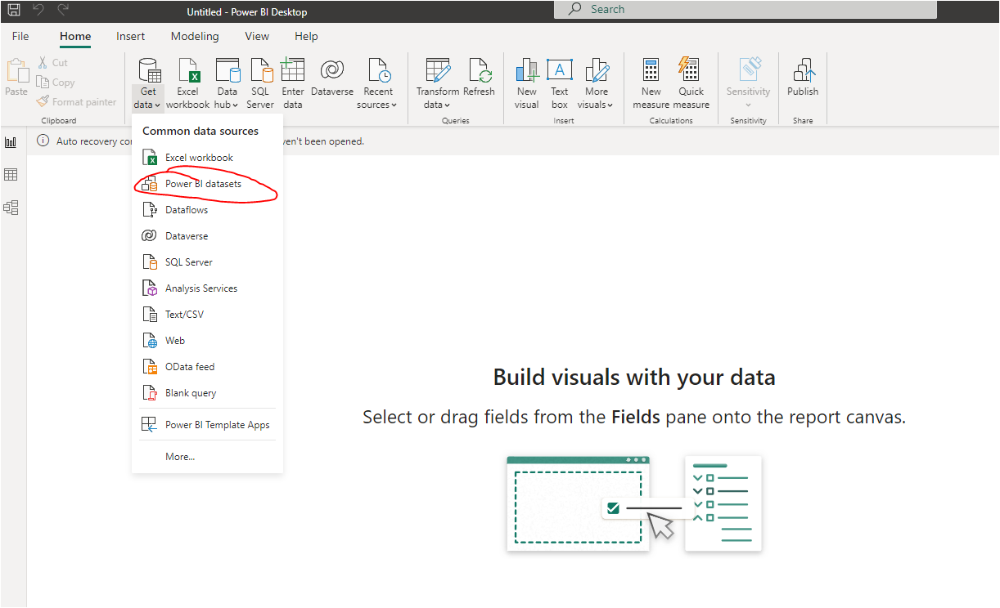
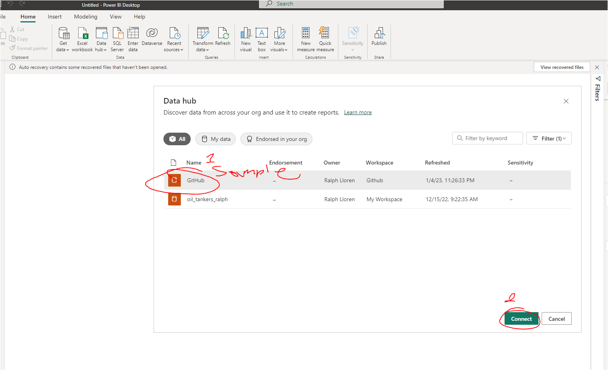
~~• Select a storage mode~~
https://learn.microsoft.com/en-us/power-bi/transform-model/desktop-storage-mode
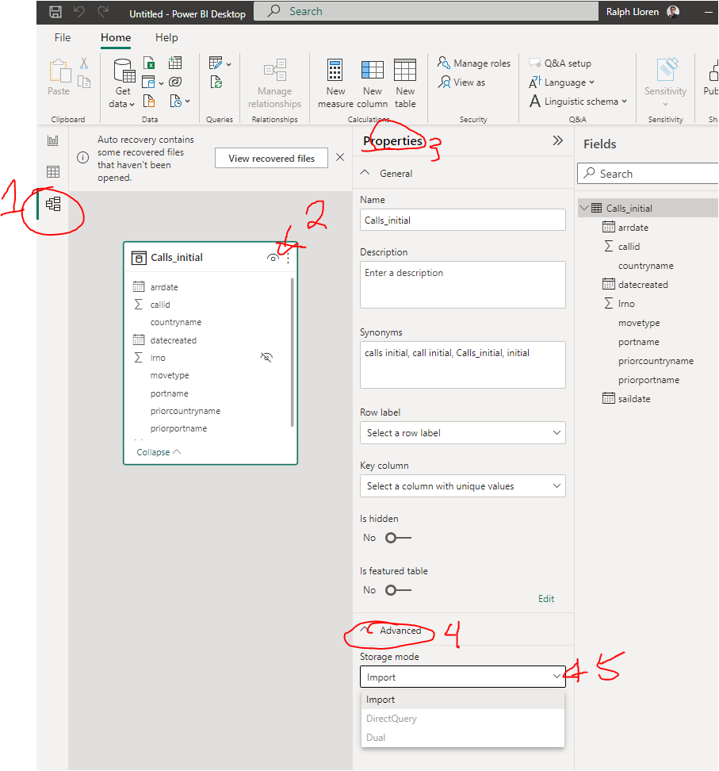
~~• Use Microsoft Dataverse~~
https://learn.microsoft.com/en-us/power-apps/maker/data-platform/data-platform-powerbi-connector?tabs=Dataverse
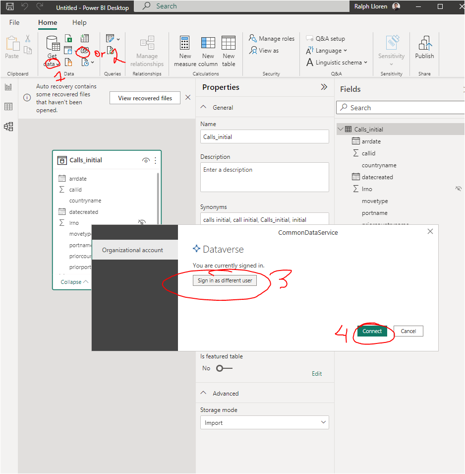
https://powerusers.microsoft.com/t5/Power-Apps-Community-Blog/Dataverse-is-not-a-database/ba-p/756215
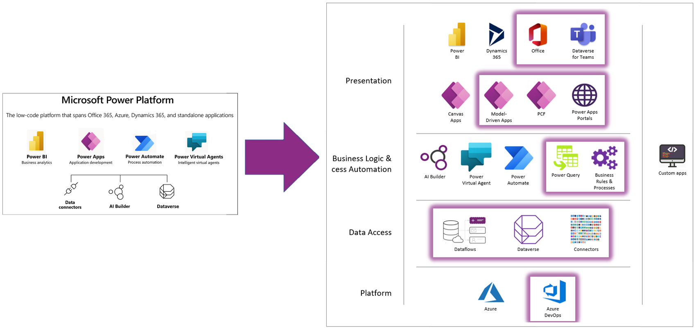
• Change the value in a parameter  
~~• Connect to a data flow~~  
https://blogs.perficient.com/2022/09/19/difference-between-dataset-dataflow-and-datamart  
Connect method same as everything else

### Clean, transform, and load the data 
~~• Profile the data~~  
• Resolve inconsistencies, unexpected or null values, and data quality issues  
• Identify and create appropriate keys for joins  
~~• Evaluate and transform column data types~~  
```
Be careful changing data type on reports that already have data downstream  
```
~~• Shape and transform tables~~  
~~• Combine queries~~  
~~• Apply user-friendly naming conventions to columns and queries~~  
```
Use descriptive business terms for tables, columns, and measures; use spaces instead of underscores  
Be consistent with abbreviations, prefaces, and words like "number" and "ID"  
`Avoid acronyms in values    
```
• Configure data loading  
~~• Resolve data import errors~~  
```
Query time out (IF DB admin set restrictions on connection time length)  
Data type error (IF source data type has been changed)
```

## Model the data (30–35%) 
### Design a data model 
~~• Define the tables~~  
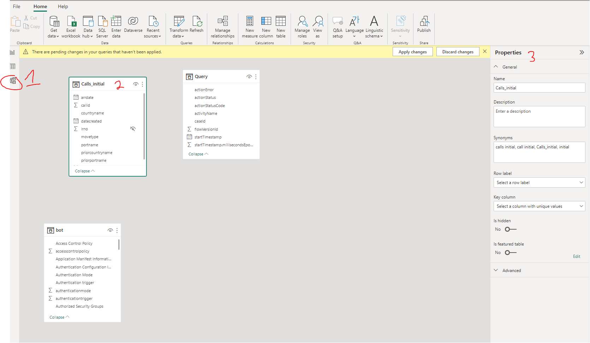
• Configure table and column properties  
• Design and implement role-playing dimensions  
~~• Define a relationship's cardinality and cross-filter direction~~  
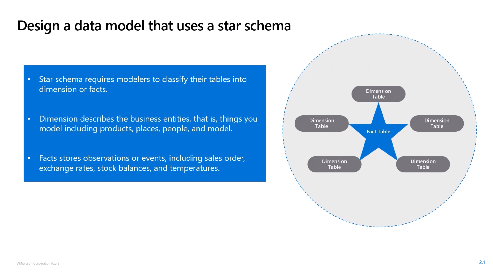
~~• Design a data model that uses a star schema~~  
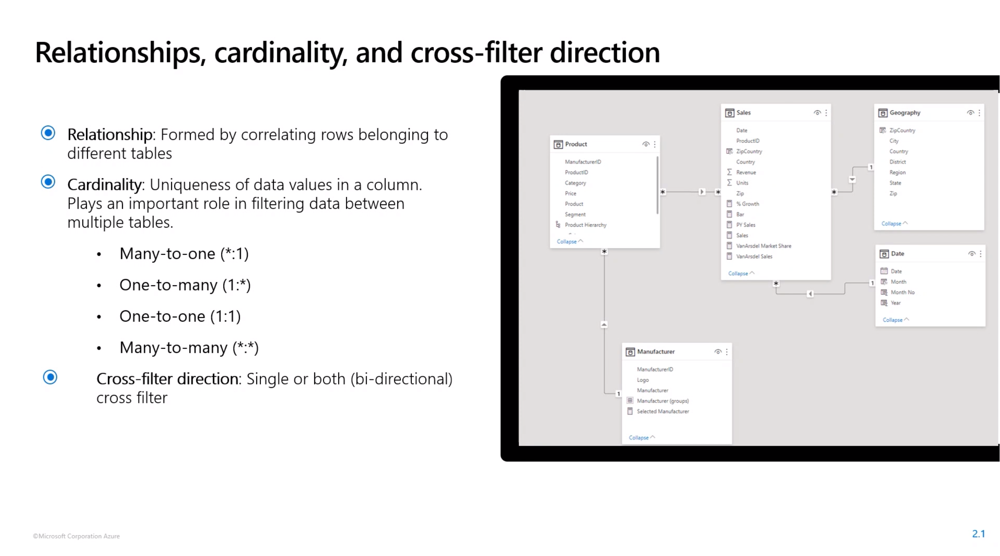
• Create a common date table  
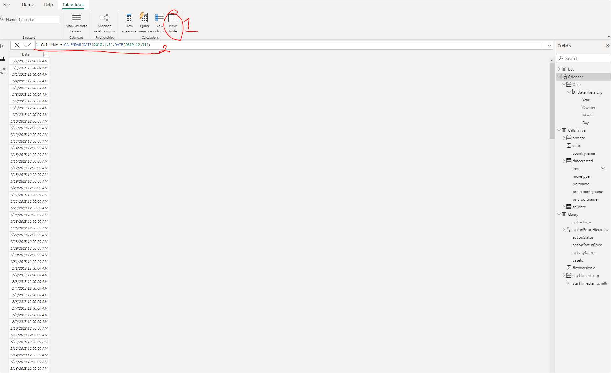

### Develop a data model 
~~• Create calculated tables~~  
```
Calendar() and CalendarAuto()
```
~~• Create hierarchies~~  
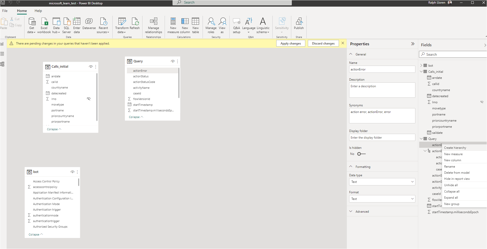
• Create calculated columns  
• Implement row-level security roles  
• Use the Q&A feature  

### Create model calculations by using DAX 
~~• Create basic measures by using DAX~~  
• Use CALCULATE to manipulate filters  
• Implement Time Intelligence using DAX  
```
***Summarizations over time***
DATESYTD - Returns a single-column table that contains dates for the YTD in the current filter context.
TOTALYTD -Evaluates an expression for YTD in the current filter context.
DATESBETWEEN - Returns a table that contains a column of dates that begins with a gien start date and continues until a given end date.
DATESINPERIOD - Rerturns a table that contains a column of dates that begins with a given start date and continues for the specified number of intervals.

***Comparisons over time***
DATEADD - Returns a table that contains a column of dates, shifted either forward or backward in time by the specified number of intervals from the dates in the current filter context.
PARALLELPERIOD - Returns a table that contains a column of dates that represents a period parallel to the dates in the specified dates column.
SAMEPERIODLASTYEAR - Returns a table that contains a column of dates that are shifted one year back in time from the dates in the specified dates column.
```
• Replace implicit measures with explicit measures  
• Use basic statistical functions  
```
Function        Description
MEDIAN          Returns the median of numbers in a column
MEDIANX         Displays the error value as 'Error' in the cell
NORM.DIS        Returns the normal distribution ofr the specified mean and standard deviation
NORM.INV        The inverse of the normal cumulative distribution for the specified mean and std dev
NORM.S.DIST     Returns the standard normal distribution (has a mean of zero and a standard dev of one)
STDEV.P         Returns the std dev of the entire population
STDEV.S         Returns the std dev of the sample population
STDEVX.P        Returns the std dev of the entire population
STDEVX.S        Returns the std dev of the sample population       
```
• Create semi-additive measures  
• Use quick measures  

### Optimize model performance 
• Remove unnecessary rows and columns  
• Identify poorly performing measures, relationships, and visuals  
• Reduce cardinality levels to improve performance  

## Visualize and analyze the data (30–35%) 
### Create reports 
• Add visualization items to reports  
• Choose an appropriate visualization type  
• Format and configure visualizations  
• Use a custom visual  
• Apply and customize a theme  
• Configure conditional formatting  
• Apply slicing and filtering  
• Configure the report page  
• Use the Analyze in Excel feature  
• Choose when to use a paginated report  

### Create dashboards 
• Manage tiles on a dashboard  
• Configure mobile view  
• Use the Q&A feature  
• Add a Quick Insights result to a dashboard  
• Apply a dashboard theme  
• Pin a live report page to a dashboard  

### Enhance reports for usability and storytelling 
• Configure bookmarks  
• Create custom tooltips  
• Edit and configure interactions between visuals  
• Configure navigation for a report  
• Apply sorting  
• Configure Sync Slicers  
• Group and layer visuals by using the selection pane  
• Drilldown into data using interactive visuals  
• Export report data  
• Design reports for mobile devices  

### Identify patterns and trends 
• Use the Analyze feature in Power BI  
• Identify outliers  
• Choose between continuous and categorical axes  
• Use groupings, binnings, and clustering  
• Use AI visuals  
• Use the Forecast feature  
• Create reference lines by using the Analytics pane  

## Deploy and maintain assets (10–15%) 
### Manage files and datasets 
• Identify when a gateway is required  
• Configure a dataset scheduled refresh  
• Configure row-level security group membership  
• Provide access to datasets  
• Manage global options for files  

### Manage workspaces 
• Create and configure a workspace  
• Assign workspace roles  
• Configure and update a workspace app  
• Publish, import, or update assets in a workspace  
• Apply sensitivity labels to workspace content  
• Configure subscriptions and data alerts  
• Promote or certify Power BI content  