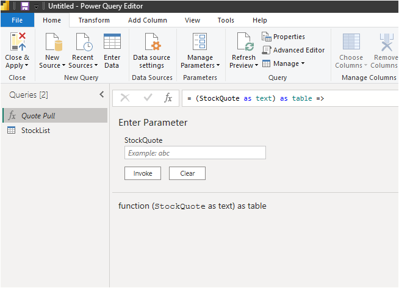
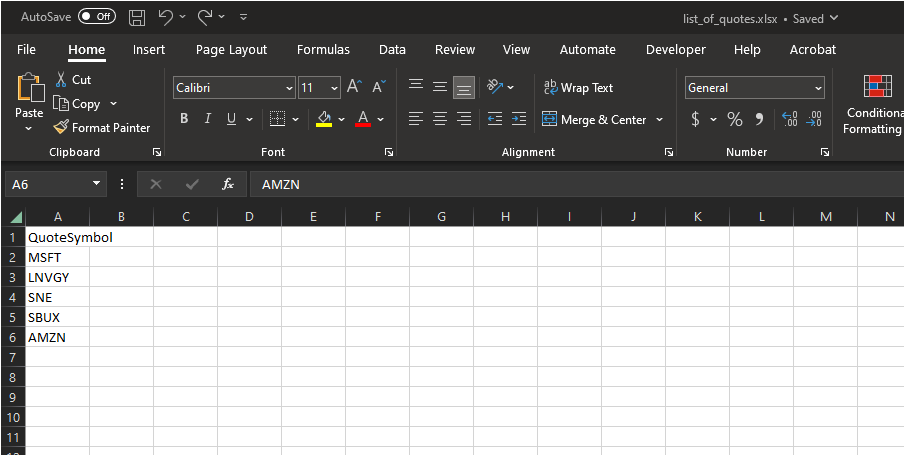
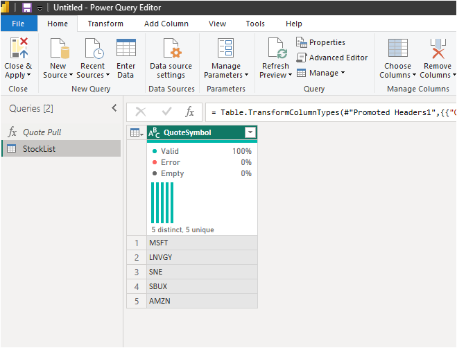
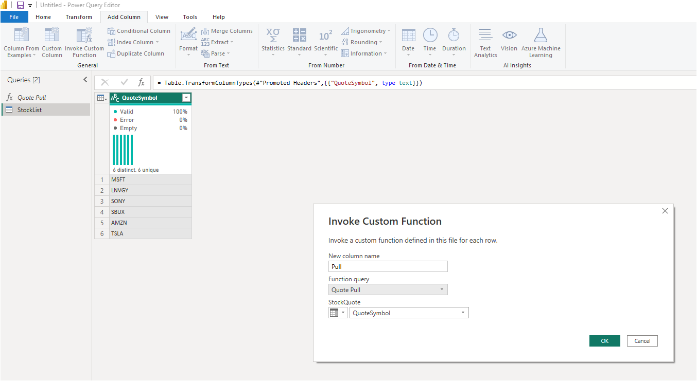

This project's goal is to pull quotes from Yahoo Finance

1. Get data into PBI from web source: https://query1.finance.yahoo.com/v7/finance/download/TSLA?period1=1642466149&period2=1674002149&interval=1d&events=history&includeAdjustedClose=true


2. Edit M in advanced editor
```
(StockQuote as text) as table =>

let
    Source = Csv.Document(Web.Contents("https://query1.finance.yahoo.com/v7/finance/download/"&StockQuote&"?period1=1642466149&period2=1674002149&interval=1d&events=history&includeAdjustedClose=true"),[Delimiter=",", Columns=7, Encoding=65001, QuoteStyle=QuoteStyle.None]),
    #"Promoted Headers" = Table.PromoteHeaders(Source, [PromoteAllScalars=true]),
    #"Changed Type" = Table.TransformColumnTypes(#"Promoted Headers",{{"Date", type date}, {"Open", type number}, {"High", type number}, {"Low", type number}, {"Close", type number}, {"Adj Close", type number}, {"Volume", Int64.Type}})
in
    #"Changed Type"
```
3. Create list_of_quotes.xslx and Get data into PBI from excel file:





4. Invoke Custom Function using the created Quote Pull Fx



5. Transformed Data to make it cleaner to look at

6. Downloaded Visuals:  1) Candlesticks 2) Chiclet Slicers

7. This project is no longer being worked on and a new project "RedQueen" takes over where project "Quote Pull" left off